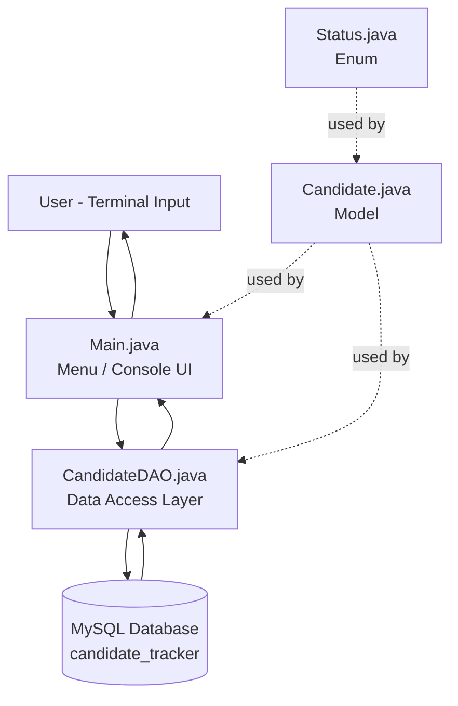
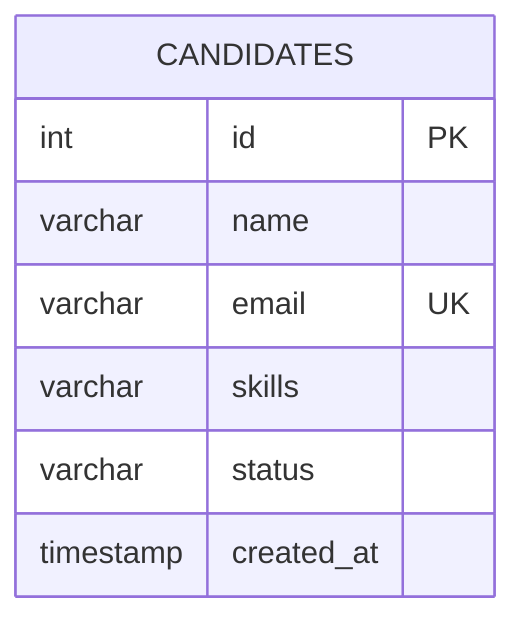
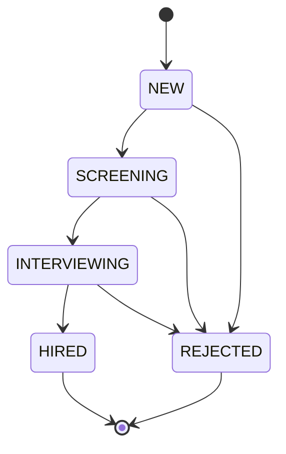
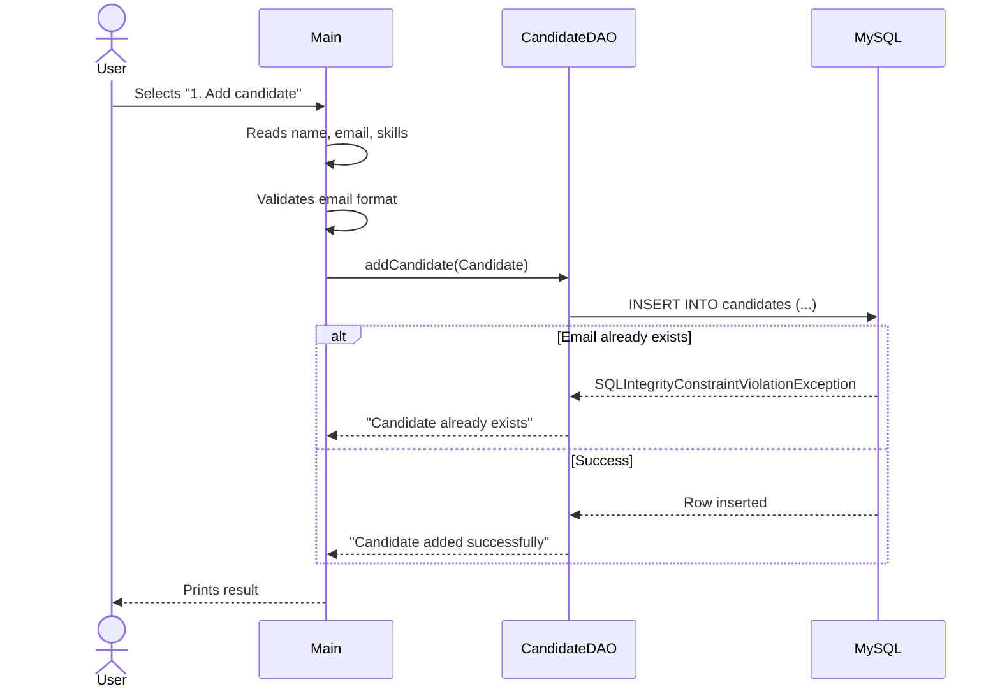

# Candidate Tracker

A console-based Java application for managing job candidates through a recruitment pipeline, built with core Java and JDBC on top of MySQL. Built as a hands-on project to practice OOP design, layered architecture, and relational database integration in Java.

## Features

- Add a candidate (name, email, skills)
- List all candidates
- Search candidates by skill (partial match)
- Update a candidate's pipeline status (`NEW → SCREENING → INTERVIEWING → HIRED/REJECTED`)
- Delete a candidate
- Input validation — email format, empty fields, duplicate-email protection
- Centralized, safe database access via `PreparedStatement` (SQL-injection safe)

## Tech Stack

| Layer | Technology |
|---|---|
| Language | Java 17+ |
| Database | MySQL 8+ |
| DB Connectivity | JDBC (MySQL Connector/J 9.7) |
| Architecture | DAO pattern, layered (UI → DAO → DB) |

## Architecture

The app follows a simple layered architecture. `Main` never talks to the database directly — it always goes through `CandidateDAO`, which is the single point of contact with MySQL. This separation means the storage layer could be swapped (e.g., for a REST API or a different database) without touching the business/menu logic.



**Layer responsibilities:**

- **Main.java** — console menu, reads user input, calls DAO methods, prints results. Contains no SQL.
- **CandidateDAO.java** — the only class that executes SQL. Converts `ResultSet` rows into `Candidate` objects and vice versa.
- **Candidate.java** — plain model class representing one candidate record.
- **Status.java** — enum representing pipeline stages, used to keep status values type-safe instead of raw strings.
- **DBConnection.java** — opens a JDBC connection to MySQL using `DriverManager`.

## Database Schema



A single `candidates` table keeps this project intentionally simple — the natural extension (see Roadmap) is splitting this into `candidates`, `jobs`, and `applications` tables with proper foreign keys.

## Candidate Status Flow

A candidate can only move forward through the pipeline (or be rejected at any stage) — the app doesn't currently enforce this at the code level, but it's the intended flow:



## Request Flow Example: Adding a Candidate



## Getting Started

### Prerequisites

- Java JDK 17+
- MySQL Server 8+
- [MySQL Connector/J 9.7](https://dev.mysql.com/downloads/connector/j/) (JDBC driver `.jar`)

### 1. Clone the repo

```bash
git clone https://github.com/YOUR-USERNAME/candidate-tracker.git
cd candidate-tracker
```

### 2. Set up the database

```bash
mysql -u root -p < schema.sql
```
This creates the `candidate_tracker` database, the `candidates` table, and inserts 3 sample rows.

### 3. Add the JDBC driver

Download `mysql-connector-j-9.7.0.jar` and place it in a `lib/` folder in the project root (this folder is gitignored — you need to add it locally):
```
candidate-tracker/
└── lib/
    └── mysql-connector-j-9.7.0.jar
```

### 4. Configure your database credentials

Edit `src/DBConnection.java`:
```java
private static final String URL = "jdbc:mysql://localhost:3306/candidate_tracker";
private static final String USER = "root";
private static final String PASSWORD = "your_mysql_password";
```

### 5. Compile and run

**Mac/Linux:**
```bash
mkdir -p out
javac -d out src/*.java
java -cp out:lib/mysql-connector-j-9.7.0.jar Main
```

**Windows:**
```bash
mkdir out
javac -d out src\*.java
java -cp "out;lib\mysql-connector-j-9.7.0.jar" Main
```

## Project Structure

```
candidate-tracker/
├── schema.sql              # Database setup script
├── README.md
├── .gitignore
└── src/
    ├── Status.java          # Enum: candidate pipeline stages
    ├── Candidate.java        # Model class representing a candidate
    ├── DBConnection.java     # Handles the JDBC connection
    ├── CandidateDAO.java     # All database read/write logic
    └── Main.java             # Console menu + program entry point
```

## Design Decisions

- **DAO pattern**: `CandidateDAO` isolates all SQL from the rest of the app. This is standard practice in production systems — it makes the code easier to test (the DAO can be mocked) and easier to migrate to a different persistence layer later.
- **PreparedStatement everywhere**: prevents SQL injection by never concatenating user input directly into a query string.
- **try-with-resources**: `Connection` and `Statement` objects are auto-closed even when an exception is thrown, preventing connection leaks — a common bug in beginner JDBC code.
- **Enum for status**: using `Status` instead of raw strings catches invalid status values at compile time rather than allowing typos like `"Intervewing"` into the database.

## Roadmap

- [ ] Split into `candidates`, `jobs`, and `applications` tables with proper foreign keys
- [ ] Enforce valid status transitions in code (reject `HIRED → NEW`, etc.)
- [ ] Add JUnit + Mockito tests for `CandidateDAO`
- [ ] Rebuild as a Spring Boot REST API with the same domain model
- [ ] Add a `stage_history` table to track time spent in each pipeline stage

## Author

**Pranay Kale**
[GitHub](https://github.com/pranayk15) · [LinkedIn](https://linkedin.com/in/pranay-kale1506)
